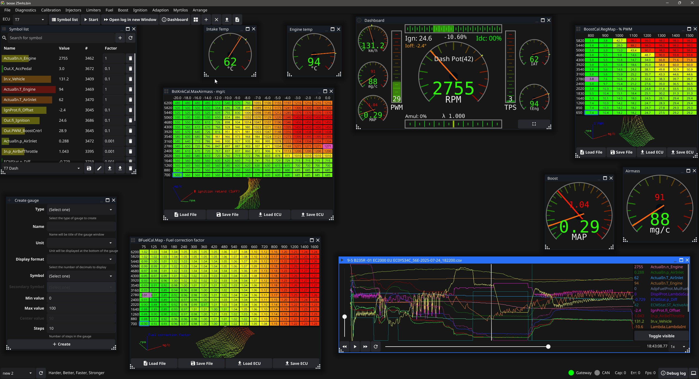

# txlogger

Blazing fast data logging for SAAB Trionic ECU's ( It does tuning to )

- Trionic 5 (9000, NG900 & OG9-3)
- Trionic 7 (OG9-3 & OG9-5)
- Trionic 8 (NG9-3)

SAAB Automobile, Gone but never forgotten

Created after discussions on [TrionicTuning](https://www.trionictuning.com/forum/viewtopic.php?f=34&t=14297)

Built with [goCAN](https://github.com/roffe/gocan)

## Bootstrap the project

Install Golang & C-compiler - [DEVELOPMENT.md](DEVELOPMENT.md) has more details.

Run the setup script to get external dependencies then "go get" to download dependencies

    .\setup_build_env.ps1
    go get .

## Run
    .\run.ps1

## Build
    .\build.ps1 -cangateway -txlogger

## Build requirements

### libusb*

libusb from vcpkg for combiadapter support

    vcpkg install 'libusb:x64-windows'

### CANlib*

https://kvaser.com/single-download/?download_id=47112  
Install in the default location `C:\Program Files (x86)\Kvaser\Canlib`

### CANUSB*

https://www.canusb.com/files/canusb_dll_driver.zip  
unzip the content of the file into a folder called "canusb" in the root of the project

###

(*) Is installed by the setup script
